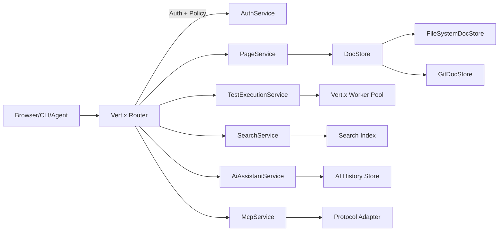

# Architecture

## Purpose
FitNesse is being modernized around Vert.x to provide async IO, modular services, and clear extension points for Git-native storage, AI features, and MCP.

## Module layout
- fitnesse-core: page model, parsing/rendering, Fit/Slim integration hooks
- fitnesse-docstore: DocStore SPI, filesystem and Git implementations
- fitnesse-web-vertx: HTTP server, routing, handlers, static assets
- fitnesse-search: indexing and query engine
- fitnesse-mcp: MCP service + protocol adapters
- fitnesse-ai: AI providers, prompt templates, workflow orchestration
- fitnesse-auth: OIDC/OAuth2 + RBAC
- fitnesse-cli: headless server, CLI runner, migration tools
- fitnesse-plugins: plugin registry + built-in adapters

## Service boundaries
- PageService: CRUD, history, metadata, attachments
- TestExecutionService: queue + runner orchestration
- SearchService: index + query
- AuditService: append-only log
- AuthService: identity, sessions, policy checks
- AiAssistantService: agent workflows + artifacts
- McpService: resources, tools, adapters

## Request flow (high level)


## Component view
```plantuml
@startuml
package "fitnesse-web-vertx" {
  [Router] --> [Handlers]
  [Handlers] --> [Services]
}
package "fitnesse-core" {
  [PageModel]
  [Parser/Renderer]
  [Fit/Slim Hooks]
}
package "fitnesse-docstore" {
  [DocStore SPI] --> [FileSystemDocStore]
  [DocStore SPI] --> [GitDocStore]
}
package "fitnesse-search" { [SearchService] }
package "fitnesse-ai" { [AiAssistantService] }
package "fitnesse-mcp" { [McpService] --> [Adapters] }
package "fitnesse-auth" { [AuthService] }
package "fitnesse-cli" { [CLI Runner] }
[Services] --> [DocStore SPI]
[Services] --> [SearchService]
[Services] --> [AiAssistantService]
[Services] --> [McpService]
[Services] --> [AuthService]
@enduml
```

## Async and blocking work
- HTTP handlers are non-blocking.
- Blocking operations (Git, Fit/Slim runs, heavy file IO) are offloaded to Vert.x worker executors.
- EventBus request/reply is the primary internal messaging path for service calls.

## Storage model
- Pages use FitNesse layout: `PageName/content.txt`, `PageName/properties.xml`, `PageName/files/**`.
- GitDocStore is authoritative in `git-native` mode; history and diff are built from Git.
- AI history and audit logs are append-only and versioned for traceability.

## Extension points
- Plugins can register routes, docstore implementations, search backends, MCP adapters, and AI providers.
- Policies are centralized and applied to UI, API, and MCP routes.
