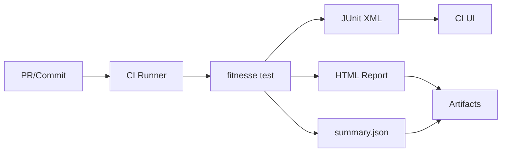

# CI

## CLI runner
Run suites in headless mode and emit standard artifacts:

```bash
fitnesse test --root FitNesseRoot --suite FrontPage --format junit,html,json --out build/fitnesse
```

Artifacts:
- `junit.xml` (or per-suite JUnit)
- `report.html` + assets
- `summary.json`

## Docker usage
```bash
docker run --rm -v "$PWD/FitNesseRoot:/data" ghcr.io/<org>/fitnesse-modern:<version> \
  fitnesse test --root /data --suite FrontPage --format junit,html,json --out /data/build
```

## GitHub Actions example
```yaml
name: FitNesse
on: [pull_request]
jobs:
  fitnesse:
    runs-on: ubuntu-latest
    steps:
      - uses: actions/checkout@v4
      - uses: docker/login-action@v3
        with:
          registry: ghcr.io
          username: ${{ github.actor }}
          password: ${{ secrets.GITHUB_TOKEN }}
      - run: |
          docker run --rm -v "$PWD/FitNesseRoot:/data" ghcr.io/<org>/fitnesse-modern:<version> \
            fitnesse test --root /data --suite FrontPage --format junit,html,json --out /data/build
      - uses: actions/upload-artifact@v4
        with:
          name: fitnesse-report
          path: FitNesseRoot/build
```

## GitLab CI example
```yaml
fitnesse:
  image: ghcr.io/<org>/fitnesse-modern:<version>
  script:
    - fitnesse test --root FitNesseRoot --suite FrontPage --format junit,html,json --out build/fitnesse
  artifacts:
    when: always
    reports:
      junit: build/fitnesse/junit.xml
    paths:
      - build/fitnesse
```

## Pipeline flow


## Exit codes
- `0`: all suites pass
- `1`: any failures
- `2`: configuration or execution error
