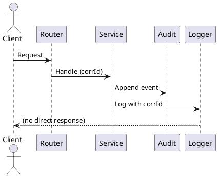

# Logging

## Goals
- Consistent structured logs across modules.
- Correlation IDs for request tracing.
- Configurable levels per module and environment.

## Defaults
- SLF4J + Vert.x logging bridge.
- Console logging in dev; JSON logging in CI/production.
- Debug traces are opt-in.

## Configuration
Example (logback or JUL config will vary by environment):

```properties
# Example level overrides
logger.fitnesse=INFO
logger.fitnesse.vertx=INFO
logger.fitnesse.docstore.git=INFO
logger.fitnesse.ai=INFO
```

## Correlation
- Each request has a correlation ID propagated through EventBus and worker pools.
- Include correlation ID in audit events and test run artifacts.

## Log pipeline


## Practices
- Do not log secrets, tokens, or page content by default.
- Use structured fields for actor, action, resource, and correlation ID.
- Use error logs for failures with minimal stack traces in production.
