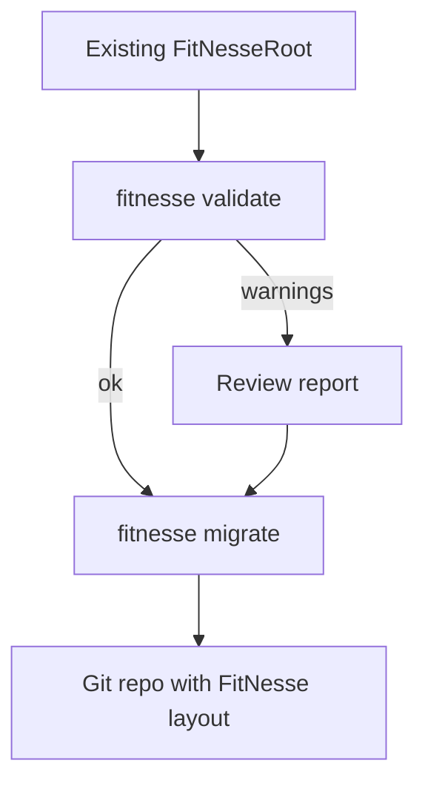

# Migration

## Modes
- `filesystem-legacy`: direct FitNesseRoot usage.
- `git-native`: Git is the authoritative store.
- `import-to-git`: one-time import into a Git repo.

## One-time import
```bash
fitnesse migrate --from FitNesseRoot --to /tmp/fitnesse-repo --initRepo
```

Outputs:
- `migration-report.json`
- optional `migration-report.md`

## Validate existing roots
```bash
fitnesse validate --root FitNesseRoot --strict
```

## Migration flow


## Compatibility guidance
- Existing `content.txt`, `properties.xml`, and attachments are preserved.
- Commits are created on write in `git-native` mode.
- Merge strategy is configurable; unresolved conflicts are stored as explicit artifacts.

## Safe adoption
- Start in `filesystem-legacy` for evaluation.
- Switch to `git-native` after a successful `import-to-git` run.
- Keep a backup of the original FitNesseRoot before migrating.
