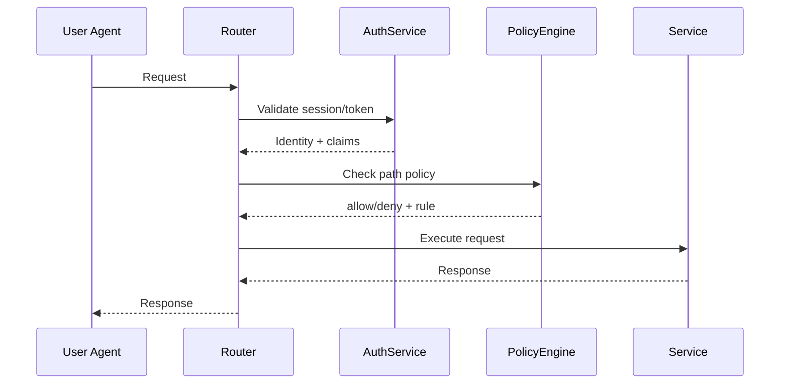

# Security

## Defaults
- Auth enabled by default; `auth.mode=none` or `auth.enabled=false` is for local/dev only.
- CSRF protections for state-changing requests.
- CSP headers enabled for UI pages.
- Secrets and tokens are never logged.

## Auth and RBAC
- OAuth2/OIDC via Vert.x auth.
- Role mapping from claims/groups.
- Policy inheritance by path; most-specific rule wins.

## Safe configuration guidance
- Use least-privilege scopes for UI/API/MCP tokens.
- Prefer path-based allow rules with explicit denies for sensitive areas.
- For MCP, start with read-only tools and gated safe actions.
- Set `docstore.git.mergeStrategy` to a conservative default (merge commit) in shared environments.

## Data protection
- Redact secrets on ingress and before persistence.
- Avoid storing OAuth tokens in page content or AI history.
- Audit log events include correlation IDs but exclude sensitive payloads.

## CORS and CSP
- Restrict CORS to known origins.
- Enforce CSP to reduce XSS exposure, especially for plugin-provided pages.

## Incident readiness
- Audit logs are append-only and tied to actor identity.
- Provide a documented procedure for revoking tokens and rotating client secrets.
